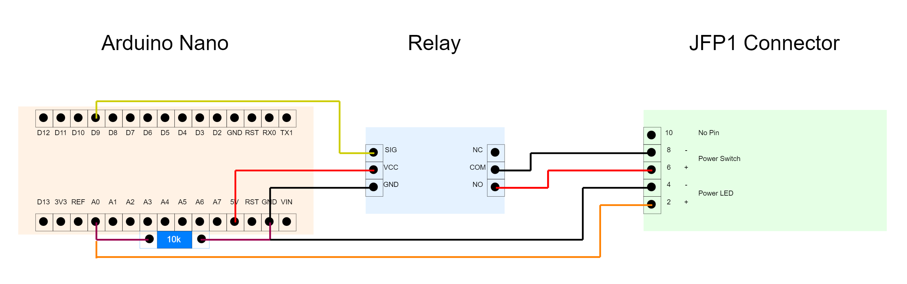

# Arduino PC Restarter

Automatically restart a computer after a power outage using an Arduino.

## How it's works
Reads the power LED on the motherboard to determine the status (ON or OFF) of the computer. If the LED is off, toggle a relay for 1 second to restart the computer.

## Schema

(draw.io file available [here](assets/schema.drawio) [`./assets/schema.drawio`])

## Result

(3D parts (STL and SolidWorks) are available [here](assets/3D) [`./assets/3D`])
